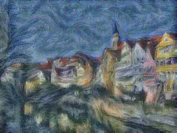

# 风格迁移的简单实作

论文地址：[A Neural Algorithm of Artistic Style](https://arxiv.org/pdf/1508.06576.pdf)

博客地址：[[实作]从图像分类到风格迁移](http://junmo.farbox.com/post/ji-qi-xue-xi/-shi-zuo-cong-tu-xiang-fen-lei-dao-feng-ge-qian-yi#content)

这个实作基于上面的论文，主要思路是之前已有的分类模型的某些层能代表图像的风格，某些层能比较代表图像的内容。所以可以尝试用一张图像作为目标图像(result_image)，将风格图像(style_image)、内容图像(content_image)、目标图像(result_image)都喂给分类模型（这个实作中使用的是SqueezeNet），比较对应层的差距。然后在每次迭代中减少这个差距来实现风格迁移的效果。

> 代码参考[cs231n](http://cs231n.stanford.edu/) 2017年春季的assignments 3 StyleTransfer-TensorFlow.ipynb

# 实例效果

内容图像：


风格图像：


结果:



# 运行

## 运行所需环境

- numpy
- scipy（这个在windows上安装有点复杂，建议先网上参照教程）
- tensorflow-gpu（或者tensorflow）
- pillow（最后阶段保存图片用，不安装也可以，修改相关代码就行）

## 用法

``` sh
python main.py [content_image_path] [style_image_path]
```

e.g.

``` sh
python main.py images/content_image.jpg images/style_image.jpg
```

指定参数示例：

``` sh
python main.py images/content_image.jpg images/style_image.jpg --content_weight 6e-2 --style_weight 300000 1000 15 3 --tv_weight 2e-2 --num_iter 200
```

